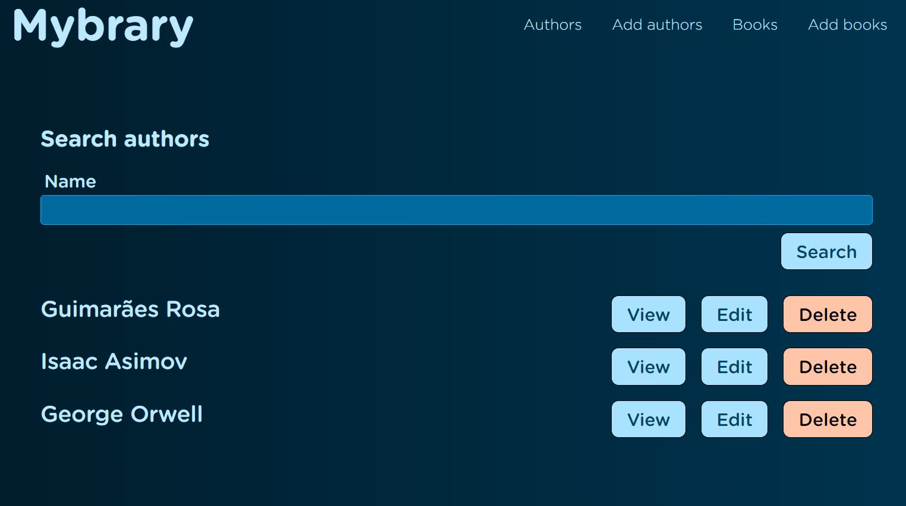
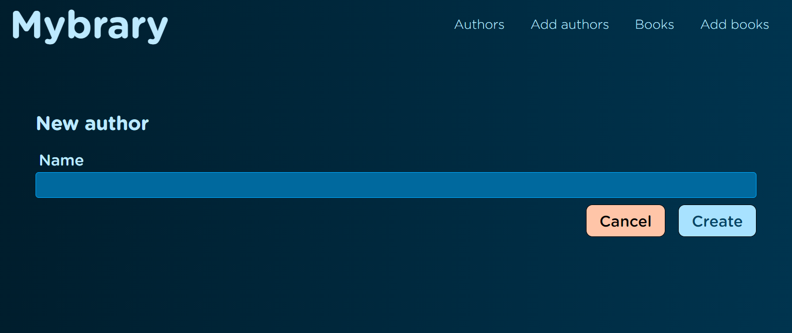
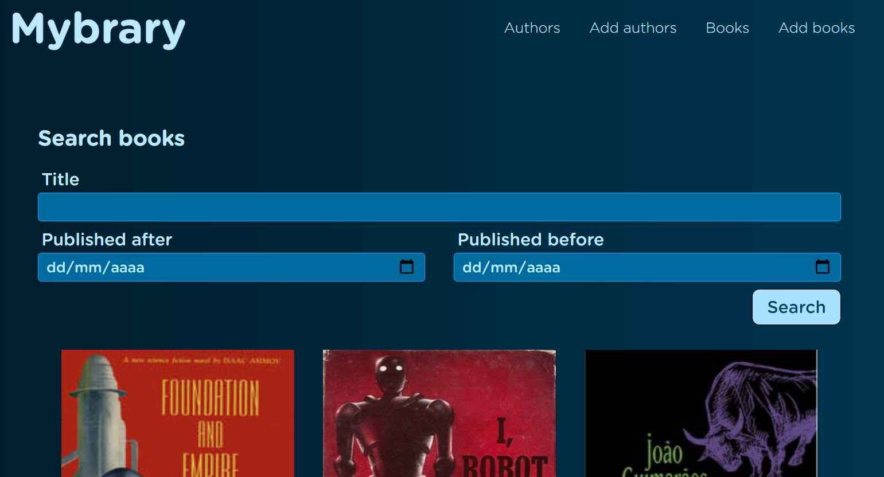
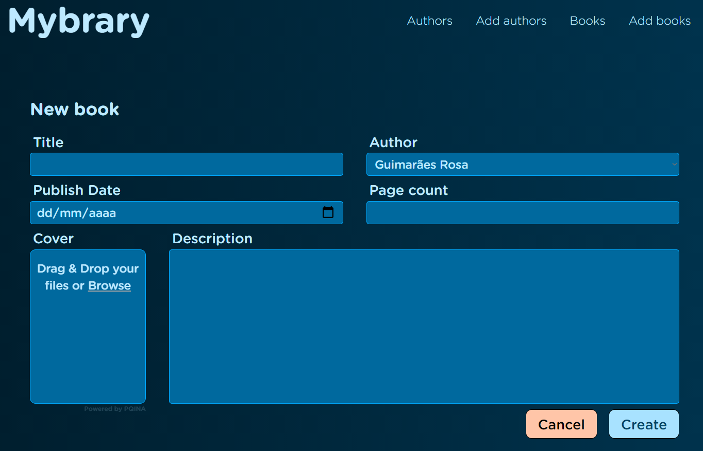
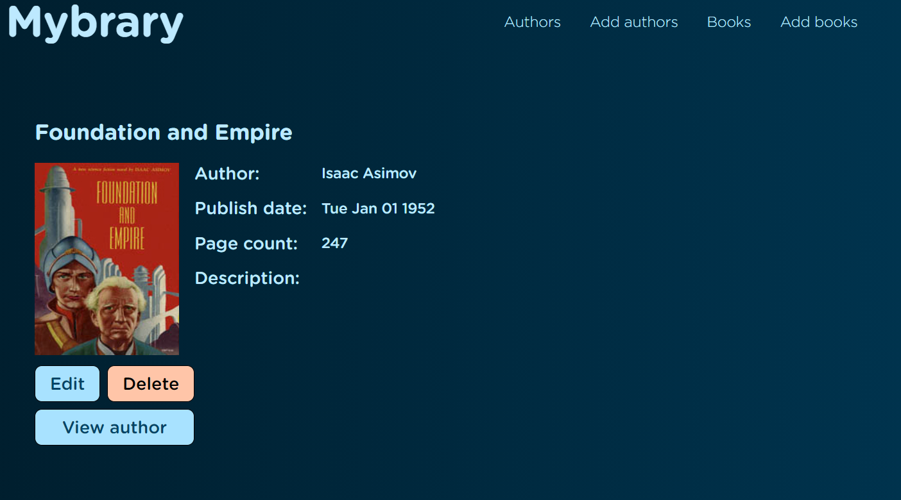

<h1 align="center" style="font-style: italic; font-weight: bold">Mybrary</h1>

## 💬 What it is?

A library that display information about the books and authors you added.

## 🤔 Why did you made this project?

I wanted to practice Node.js and learn MongoDB, MVC model, and how to deploy in Heroku.

## 🛠️ What technologies did you use?

-   HTML
-   CSS
-   Javascript
-   Node.js
-   Express.js
-   MongoDB Atlas
-   EJS
-   Heroku

## 🕹️ How to execute?

Just access this [link](https://tutorial-mybrary.herokuapp.com/), it already contains some books and authors.

The functionalities are:

1. Show all authors
1. Add, show, edit and delete a specific author
1. Show all books
1. Add, show, edit and delete a specific author

It looks like this:

1. Show all authors

2. Add, show, edit and delete a specific author

4. Show all books

5. Add, show, edit and delete a specific book

  
  <a href="https://www.youtube.com/playlist?list=PLZlA0Gpn_vH8jbFkBjOuFjhxANC63OmXM">Full Stack Web Development Course</a>

